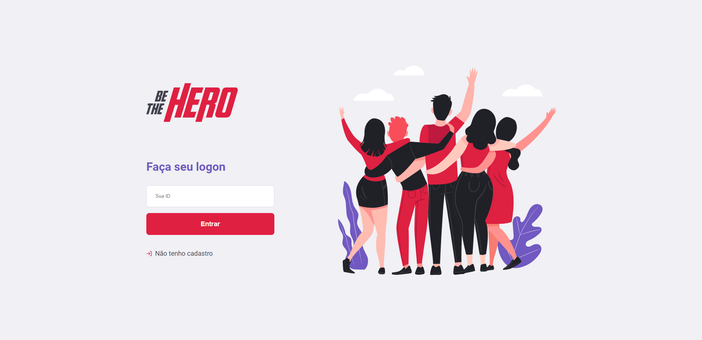
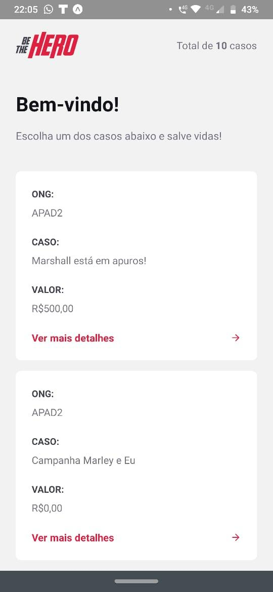
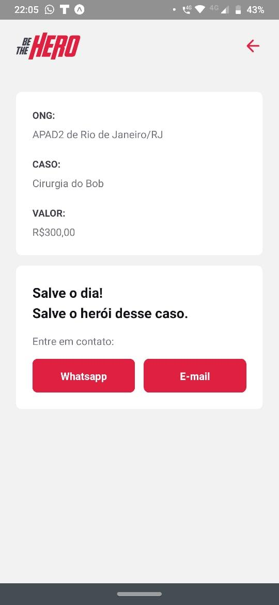

  

Este projeto foi desenvolvido em uma única semana no decorrer da **Semana Omnistack #11** da **[Rocketseat](https://rocketseat.com.br/)** 🚀.

O aplicativo busca auxiliar *ONGs* a receberem doações para ocorrências/incidentes que necessitem de alguma quantidade de dinheiro para serem tratados.

## Front end 

## Mobile

|                      Listagem de Casos                       |                      Descrição do Caso                       |
| :----------------------------------------------------------: | :----------------------------------------------------------: |
|  |  |

## Tecnologias

Foram utilizados:

	- nodeJS para a API
	- React para o front-end
	- React-native para o back-end
